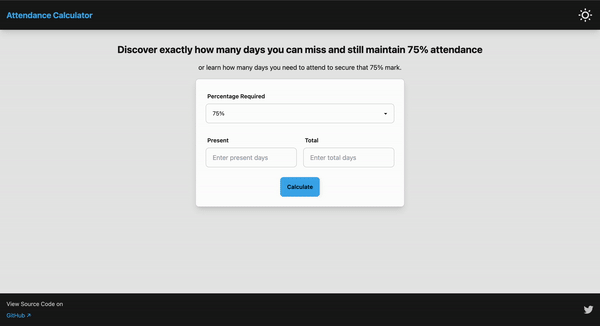

# Attendance Percentage Calculator

## Overview



The Attendance Percentage Calculator is a web application designed to help students easily determine their attendance percentage and manage their attendance records effectively. Users can find out how many days they can bunk while still maintaining the required attendance percentage or how many more classes they need to attend to reach that percentage.

## Features

- **Calculate Attendance**: Input the number of days present and total classes to calculate the attendance percentage.
- **Bunk Days**: Determine the maximum number of days a student can bunk while still maintaining the required attendance percentage.
- **Responsive Design**: The app is built with responsive design principles to ensure a seamless user experience on various devices.
- **Light/Dark Theme**: Toggle between light and dark themes for better visibility and usability.

## Technologies Used

- **HTML5**: For the structure of the web application.
- **CSS3**: For styling the application using DaisyUI and Tailwind CSS.
- **JavaScript**: For dynamic interactions and calculations.
- **DaisyUI**: A component library that makes it easy to style the application.
- **Tailwind CSS**: A utility-first CSS framework for custom styling.

## Installation

To run the project locally, follow these steps:

1. Clone the repository:
   ```bash
   git clone https://github.com/rahulbiradar06/attendancecalculator.git

   
